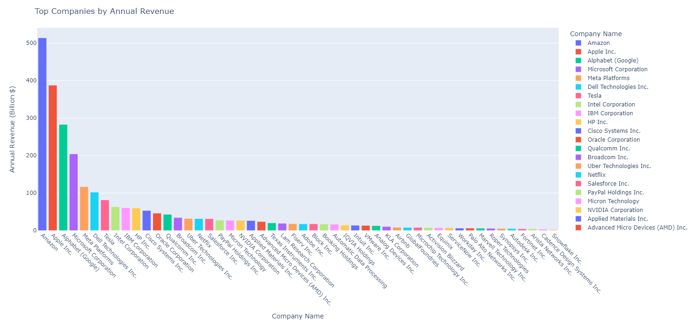

# Exploratory Data Analysis of Top 50 Tech Companies in the US

----
## Problem Statement
In this project, I conducted an Exploratory Data Analysis (EDA) of the top 50 tech companies in the US. The aim was to gain insights into various facets like financial performance, workforce demographics, and operational trends, shedding light on what makes these companies thrive by scrutinizing metrics such as revenue, market capitalization, taxes paid, and employee statistics.

Key Questions Explored:

- What are the top companies ranked by annual revenue?
- How do companies rank by market capitalization?
- Which companies pay the highest annual income tax?
- What are the largest companies by employee size?

## Dataset Overview
**Description**
The dataset comprises records of the top 50 tech companies in the US, spanning the fiscal years 2022-2023. It includes details such as company name, annual revenue, market capitalization, annual income tax, employee size, founding year, industry, and headquarters state. Each entry represents a distinct tech company, providing insights into their financial performance and operational metrics.

**Columns:** 
- **Company Name:** Name of the tech company.
- **Annual Revenue (Billion $):** Revenue generated by the company in billions of US dollars.
- **Market Cap (Trillion $):** Market capitalization of the company in trillions of US dollars.
- **Annual Income Tax (Billion $):** Annual income tax paid by the company in billions of US dollars.
- **Employee Size:** Number of employees in the company.
- **Founding Year:** Year the company was founded.
- **Industry:** Industry in which the company operates.
- **HQ State:** Headquarters state of the company.

## Data Cleaning and Transformation
In this section, we perform data cleaning and transformation to ensure the dataset's integrity and suitability for analysis.

**Step 1: Data Cleaning**
- **Removal of Irrelevant Columns:** Irrelevant columns such as 'Founding Year' and 'Industry' were dropped from the dataset to focus on relevant metrics.
```
# Drop the 'Founding Year' and 'Industry' columns from the DataFrame
df.drop(['Founding Year', 'Industry'], axis=1, inplace=True)
df.head()
```
- **Renaming Columns:** Column names were modified for clarity and consistency.
```
# Modify the column name 
column_name = {'Annual Revenue 2022-2023 (USD in Billions)':'Annual Revenue (Billion $)',
          'Market Cap (USD in Trillions)':'Market Cap (Trillion $)',
          'Annual Income Tax in 2022-2023 (USD in Billions)':'Annual Income Tax (Billion $)'}
df.rename(columns = column_name, inplace = True)
df.head()
```
- **Handling Missing Values:** Missing values were identified and addressed through appropriate techniques such as imputation or creation of new categories.

## Data Analysis and Insights
**1. Ranking Companies by Annual Revenue**
We group the data by company name and sum the annual revenue to determine the top companies ranked by annual revenue. Visualization through a bar chart provides insights into the revenue distribution among the leading tech firms.
```
# Grouping the data
annual_revenue_grouped = df.groupby('Company Name')['Annual Revenue (Billion $)'].sum().reset_index()

# Sort the result in descending order to find the company with the highest revenue 
annual_revenue = annual_revenue_grouped.sort_values('Annual Revenue (Billion $)', ascending = False)

annual_revenue.head(10)
```
```
# Creating a bar chat to visualize this data 
fig = px.bar(annual_revenue, x='Company Name', y='Annual Revenue (Billion $)', color='Company Name')
fig.update_layout(title='Top Companies by Annual Revenue', xaxis_title='Company Name', yaxis_title='Annual Revenue (Billion $)')
fig.update_xaxes(tickangle=45)
fig.update_layout(width = 1500, height = 700)
fig.show()
```


**2. Ranking Companies by Market Capitalization**
Similar to the approach for annual revenue, we group the data by company name and sum the market capitalization to identify the top companies by market capitalization. Visualization using a bar chart highlights the market dominance of leading tech giants.

**3. Ranking Companies by Annual Income Tax**
Grouping the data by company name and summing the annual income tax enables us to identify the companies paying the highest income tax. Visualization through a bar chart illustrates the tax contributions of various tech companies.

**4. Ranking Companies by Employee Size**
By grouping the data by company name and summing the employee size, we determine the largest companies by employee count. Visualization using a bar chart showcases the workforce distribution across the top tech firms.
