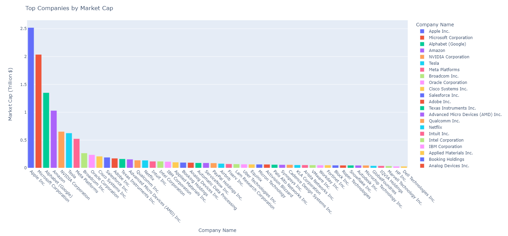
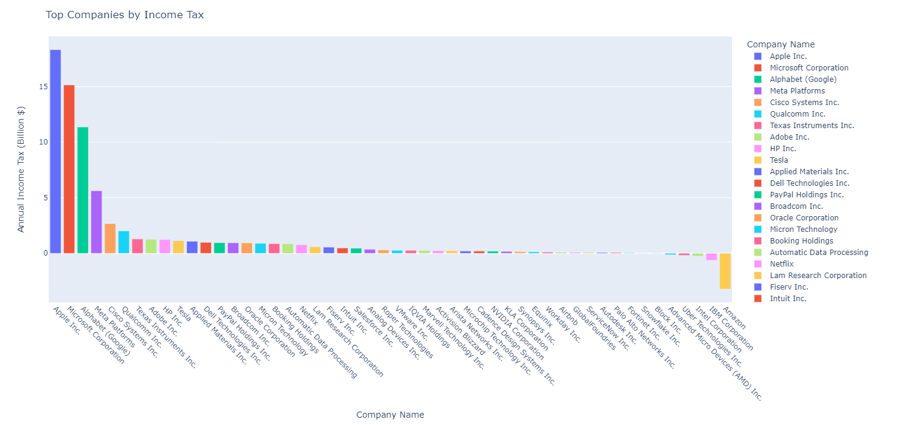
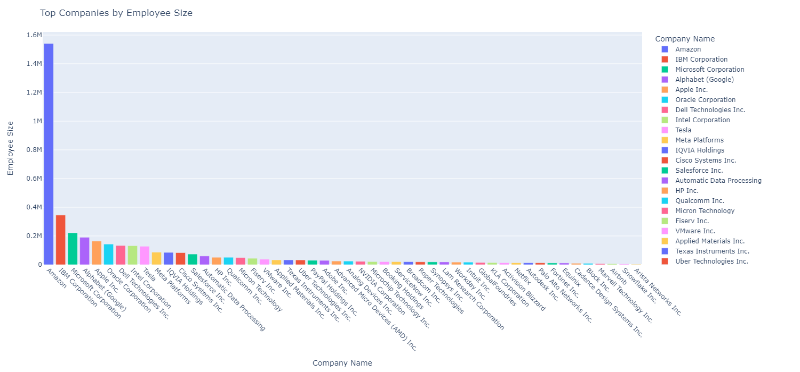
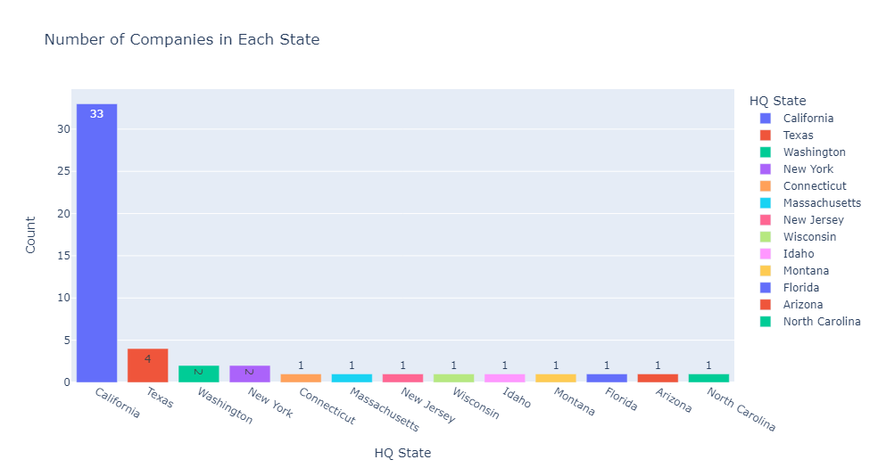
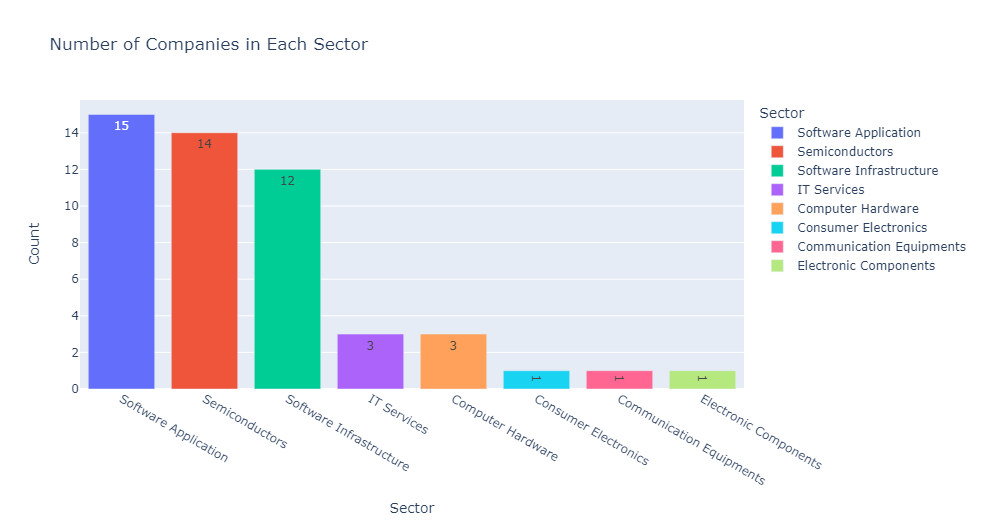
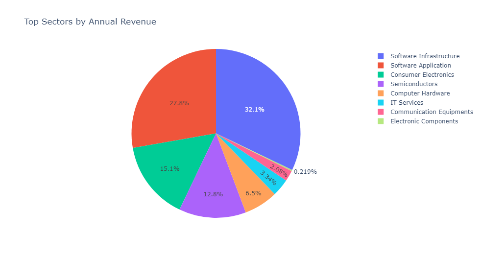
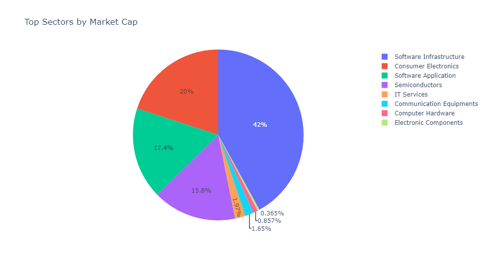
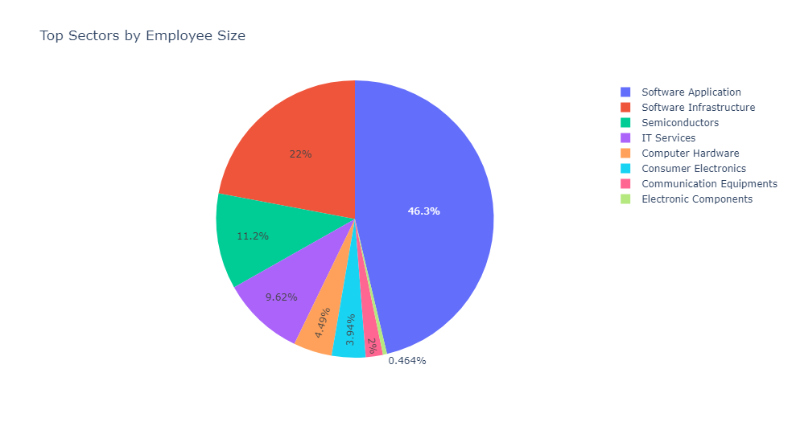
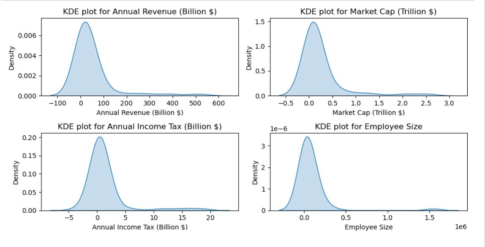
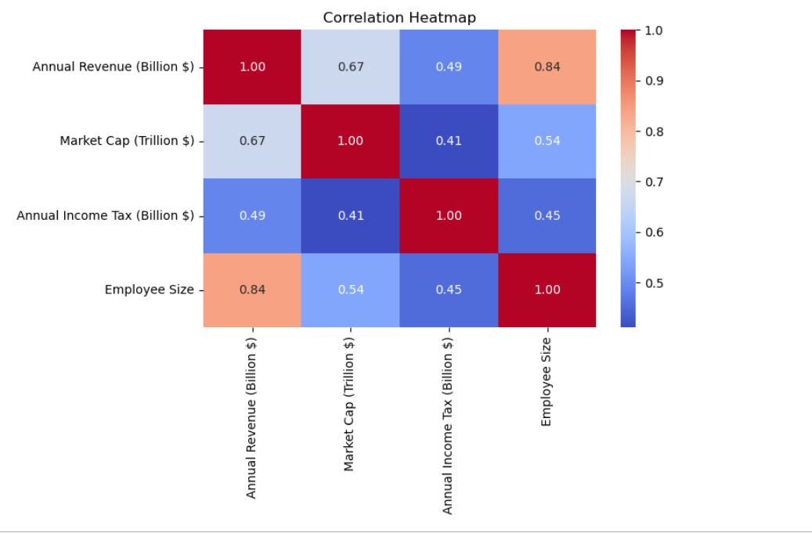

# Exploratory Data Analysis of Top 50 Tech Companies in the US

----
# Problem Statement
In this project, I conducted an Exploratory Data Analysis (EDA) of the top 50 tech companies in the US. The aim was to gain insights into various facets like financial performance, workforce demographics, and operational trends, shedding light on what makes these companies thrive by scrutinizing metrics such as revenue, market capitalization, taxes paid, and employee statistics.

Key Questions Explored:

- What are the top companies ranked by annual revenue?
- How do companies rank by market capitalization?
- Which companies pay the highest annual income tax?
- What are the largest companies by employee size?

# Dataset Overview
#### Description

The dataset comprises records of the top 50 tech companies in the US, spanning the fiscal years 2022-2023. It includes details such as company name, annual revenue, market capitalization, annual income tax, employee size, founding year, industry, and headquarters state. Each entry represents a distinct tech company, providing insights into their financial performance and operational metrics.

#### Columns:
- **Company Name:** Name of the tech company.
- **Annual Revenue (Billion $):** Revenue generated by the company in billions of US dollars.
- **Market Cap (Trillion $):** Market capitalization of the company in trillions of US dollars.
- **Annual Income Tax (Billion $):** Annual income tax paid by the company in billions of US dollars.
- **Employee Size:** Number of employees in the company.
- **Founding Year:** Year the company was founded.
- **Industry:** Industry in which the company operates.
- **HQ State:** Headquarters state of the company.

# Data Cleaning and Transformation
In this section, I perform data cleaning and transformation to ensure the dataset's integrity and suitability for analysis.

#### Data Cleaning
- **Removal of Irrelevant Columns:** Irrelevant columns such as 'Founding Year' and 'Industry' were dropped from the dataset to focus on relevant metrics.
```
# Drop the 'Founding Year' and 'Industry' columns from the DataFrame
df.drop(['Founding Year', 'Industry'], axis=1, inplace=True)
df.head()
```
- **Renaming Columns:** Column names were modified for clarity and consistency.
```
# Modify the column name 
column_name = {'Annual Revenue 2022-2023 (USD in Billions)':'Annual Revenue (Billion $)',
          'Market Cap (USD in Trillions)':'Market Cap (Trillion $)',
          'Annual Income Tax in 2022-2023 (USD in Billions)':'Annual Income Tax (Billion $)'}
df.rename(columns = column_name, inplace = True)
df.head()
```
- **Handling Missing Values:** Missing values were identified and addressed through appropriate techniques such as imputation or creation of new categories.

# Data Analysis and Insights

#### 1. Ranking Companies by Annual Revenue

I group the data by company name and sum the annual revenue to determine the top companies ranked by annual revenue. Visualizing this data through a bar chart provides insights into the revenue distribution among the leading tech firms.
```
# Grouping the data
annual_revenue_grouped = df.groupby('Company Name')['Annual Revenue (Billion $)'].sum().reset_index()

# Sort the result in descending order to find the company with the highest revenue 
annual_revenue = annual_revenue_grouped.sort_values('Annual Revenue (Billion $)', ascending = False)

annual_revenue.head(10)
```
```
# Creating a bar chat to visualize this data 
fig = px.bar(annual_revenue, x='Company Name', y='Annual Revenue (Billion $)', color='Company Name')
fig.update_layout(title='Top Companies by Annual Revenue', xaxis_title='Company Name', yaxis_title='Annual Revenue (Billion $)')
fig.update_xaxes(tickangle=45)
fig.update_layout(width = 1500, height = 700)
fig.show()
```


#### 2. Ranking Companies by Market Capitalization

Similarly to the approach for annual revenue, I group the data by company name and sum the market capitalization to identify the top companies by market capitalization. Visualizing this data using a bar chart highlights the market dominance of leading tech giants.
```
# Grouping the data
market_cap_grouped = df.groupby('Company Name')['Market Cap (Trillion $)'].sum().reset_index()

# Sort the result in descending order to find the company with the market cap 
market_cap = market_cap_grouped.sort_values('Market Cap (Trillion $)', ascending = False)

market_cap.head(10)
```
```
# Creating a bar chat to visualize this data 
fig = px.bar(market_cap, x='Company Name', y='Market Cap (Trillion $)', color='Company Name')
fig.update_layout(title='Top Companies by Market Cap', xaxis_title='Company Name', yaxis_title='Market Cap (Trillion $)')
fig.update_xaxes(tickangle=45)
fig.update_layout(width = 1500, height = 700)
fig.show()
```


#### 3. Ranking Companies by Annual Income Tax

I group the data by company name and sum the annual income tax, enabling me to identify the companies paying the highest income tax. Visualizing this data through a bar chart illustrates the tax contributions of various tech companies.
```
# Grouping the data
income_tax_grouped = df.groupby('Company Name')['Annual Income Tax (Billion $)'].sum().reset_index()

# Sort the result in descending order to find the company with the market cap 
income_tax = income_tax_grouped.sort_values('Annual Income Tax (Billion $)', ascending = False)

income_tax.head(10)
```
```
# Creating a bar chat to visualize this data 
fig = px.bar(income_tax, x='Company Name', y='Annual Income Tax (Billion $)', color='Company Name')
fig.update_layout(title='Top Companies by Income Tax', xaxis_title='Company Name', yaxis_title='Annual Income Tax (Billion $)')
fig.update_xaxes(tickangle=45)
fig.update_layout(width = 1500, height = 700)
fig.show()
```



#### 4. Ranking Companies by Employee Size

By grouping the data by company name and summing the employee size, i was able to determine the largest companies by employee count. Visualization using a bar chart showcases the workforce distribution across the top tech firms.
```
# Grouping the data
employee_size_grouped = df.groupby('Company Name')['Employee Size'].sum().reset_index()

# Sort the result in descending order to find the company with the market cap 
employee_size = employee_size_grouped.sort_values('Employee Size', ascending = False)

employee_size.head(10)
```
```
# Creating a bar chat to visualize this data 
fig = px.bar(employee_size, x='Company Name', y='Employee Size', color='Company Name')
fig.update_layout(title='Top Companies by Employee Size', xaxis_title='Company Name', yaxis_title='Employee Size')
fig.update_xaxes(tickangle=45)
fig.update_layout(width = 1500, height = 700)
fig.show()
```


# Geographical Analysis
I analyzed the geographical distribution of the headquarters (HQ) of these top tech companies. The dataset revealed that California hosts the majority of these companies, followed by Texas and Washington. I created a visualization to illustrate the number of companies in each state.
```
# Group Companies in each state 
hq_state = df['HQ State'].value_counts().reset_index()
hq_state
```
```
# Create a bar chat to visualize the number of companies in each state 
# Rename columns for clarity
hq_state.columns = ['HQ State', 'Count']

# Plotting
fig = px.bar(hq_state, x='HQ State', y='Count', text = 'Count', color='HQ State', title='Number of Companies in Each State')
fig.show()
```


# Sector Analysis
I examined the distribution of companies across various sectors. The dataset categorized companies into different sectors, with Software Application having 15 companies, Semiconductors with 14, Software Infrastructure with 12, IT Services and Computer Hardware with 3 each, and Consumer Electronics and Communication Equipments with 1 company each. This information was used to create a bar chart illustrating the number of companies in each sector.
```
# Group the data
sector_distribution = df['Sector'].value_counts().reset_index()
sector_distribution
```
```
# Create a bar chat to visualize the number of companies in each Sector 
# Rename columns for clarity
sector_distribution.columns = ['Sector', 'Count']

# Plotting
fig = px.bar(sector_distribution, x='Sector', y='Count', text = 'Count', color='Sector', title='Number of Companies in Each Sector')
fig.show()
```


# Market Analysis
I proceeded to analyze the market performance of these companies, considering metrics such as annual revenue, market capitalization, and employee size. Visualizations were generated to highlight the top sectors based on annual revenue, market capitalization, and employee size.

#### 1. Sector vs Annual Revenue

In this section, I conduct a comprehensive analysis of sectors within the technology industry based on their annual revenue. By examining the distribution of revenue across different sectors, I aim to uncover insights into the relative importance and contribution of each sector to the overall revenue landscape.
```
# Group the data
sector_revenue = df.groupby('Sector')['Annual Revenue (Billion $)'].sum().reset_index()

#Sort the values in descending order 
sector_revenue = sector_revenue.sort_values(by = 'Annual Revenue (Billion $)', ascending = False).reset_index(drop = True)
sector_revenue
```
```
# Visualizing the distribution of total annual revenue by sector using a pie chart
fig = px.pie(sector_revenue, values='Annual Revenue (Billion $)', names='Sector',
             title='Top Sectors by Annual Revenue')
fig.show()
```


#### 2. Sector vs Market Capitalization

In this section, I'll analyze the technology industry's sectors by their market value. I aim to determine each sector's significance and contribution to the overall market value.
```
# Group the data
sector_marketcap = df.groupby('Sector')['Market Cap (Trillion $)'].sum().reset_index()

#Sort the values in descending order 
sector_marketcap = sector_marketcap.sort_values(by = 'Market Cap (Trillion $)', ascending = False).reset_index(drop = True)
sector_marketcap
```
```
# Visualizing the distribution of top Market Cap by sector using a pie chart
fig = px.pie(sector_marketcap, values='Market Cap (Trillion $)', names='Sector',
             title='Top Sectors by Market Cap')
fig.show()
```


#### 3. Sector vs Employee Size

In this part, I'll take a look at how many employees each sector in the tech industry has. My aim is to see which sectors have the most employees and how they contribute to the total number of employees in the industry.
```
# Group the data
sector_employeesize = df.groupby('Sector')['Employee Size'].sum().reset_index()

#Sort the values in descending order 
sector_employeesize = sector_employeesize.sort_values(by = 'Employee Size', ascending = False).reset_index(drop = True)
sector_employeesize
```
```
# Visualizing the distribution of Employee Size by sector using a pie chart
fig = px.pie(sector_employeesize, values='Employee Size', names='Sector',
             title='Top Sectors by Employee Size')
fig.show()
```


# Correlation Analysis
Finally, conducted a correlation analysis to understand the relationships between key metrics such as annual revenue, market capitalization, taxes paid, and employee size. The distribution of numeric columns was explored, followed by the calculation of Spearman correlation coefficients for non-normally distributed data. A heatmap was generated to visualize the correlation matrix.
```
# List of columns 
columns = ['Annual Revenue (Billion $)', 'Market Cap (Trillion $)', 'Annual Income Tax (Billion $)', 'Employee Size']

# Creating a subplot for each column
plt.figure(figsize = (10,5))
for i, column in enumerate(columns, 1):
    plt.subplot(2, 2, i)
    sns.kdeplot(data = df, x=column, fill=True)
    plt.title(f'KDE plot for {column}')
    
plt.tight_layout()
plt.show()
```
#### KDE Subplots


```
# Calculating the correlation matrix using Spearman method

correlation_matrix = df[['Annual Revenue (Billion $)', 'Market Cap (Trillion $)', 'Annual Income Tax (Billion $)',
                         'Employee Size']].corr(method = 'spearman')
```
```
# Displaying a heatmap to visualize the correlation matrix

plt.figure(figsize=(8,6))
sns.heatmap(correlation_matrix, annot = True, cmap = 'coolwarm', fmt = '.2f')
plt.title('Correlation Heatmap')
plt.tight_layout()

plt.show()
```



# Recommendations
Based on our analysis, we recommend the following:

- **Diversification of Operations:** Companies should consider diversifying their operations across different states to mitigate geographical risks and tap into diverse talent pools.
- **Investment in High-Growth Sectors:** Companies should focus on sectors with high growth potential, such as Software Application and Semiconductors, to maximize revenue and market capitalization.
- **Optimization of Tax Strategies:** Companies should optimize their tax strategies to minimize tax liabilities while ensuring compliance with regulations.
- **Focus on Employee Development:** Companies should prioritize employee development and retention to enhance productivity and innovation.
